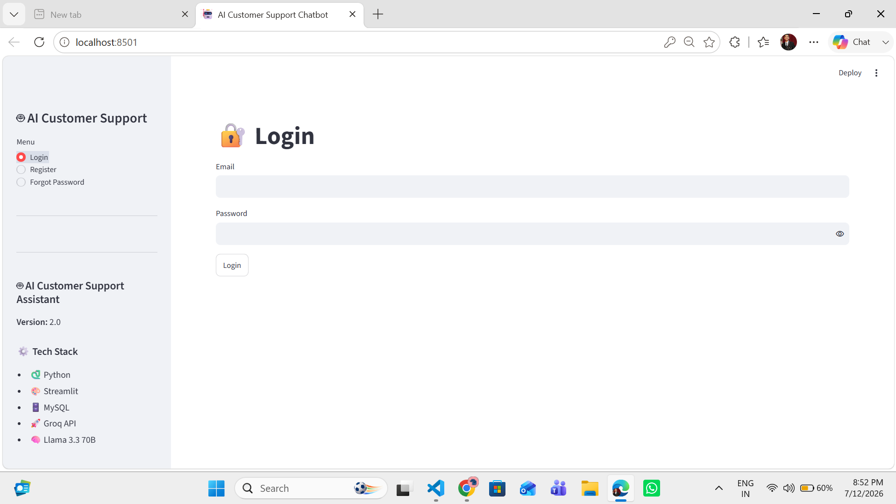
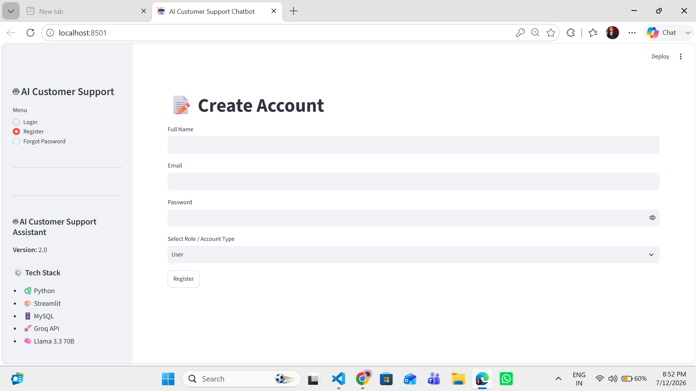
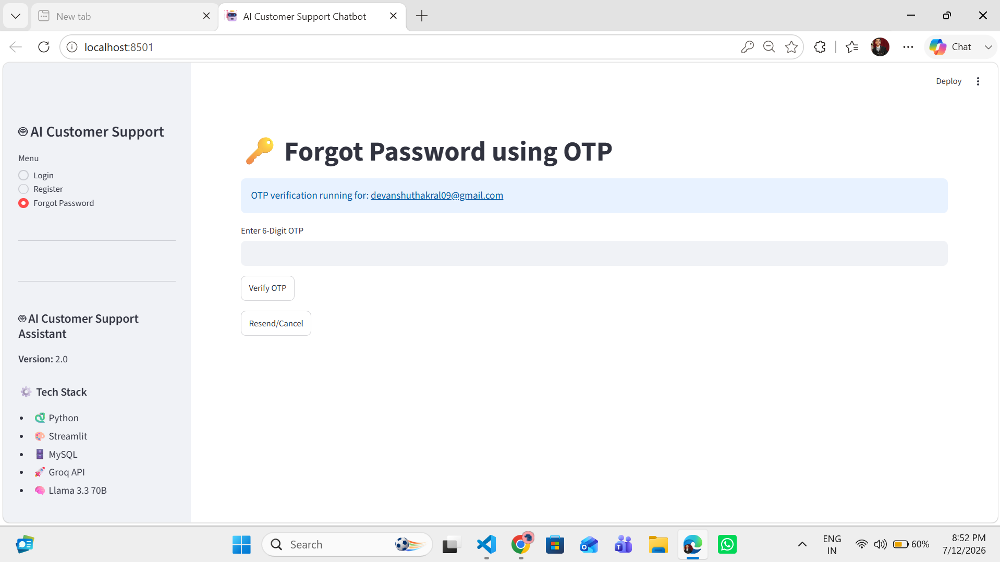
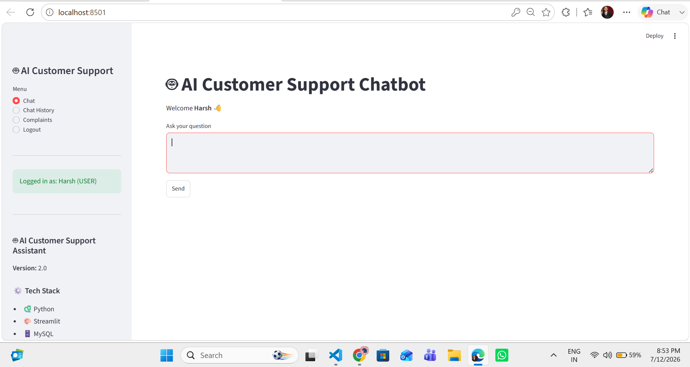
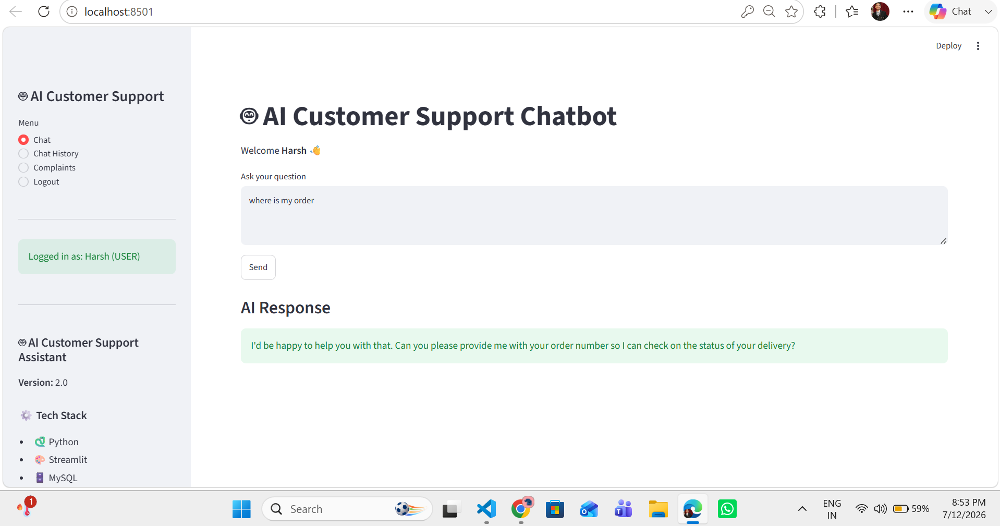
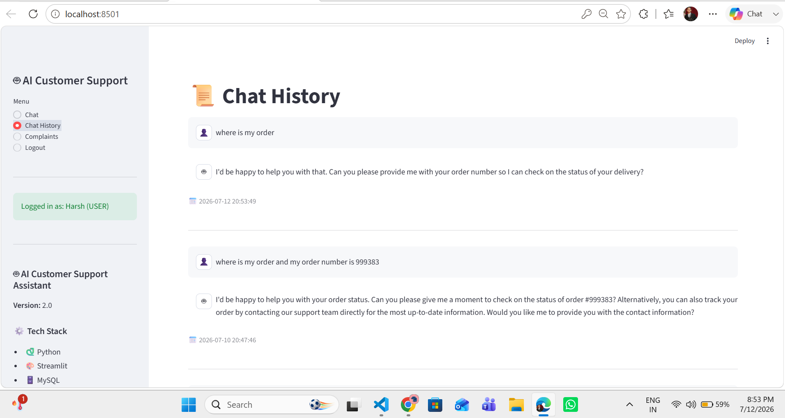
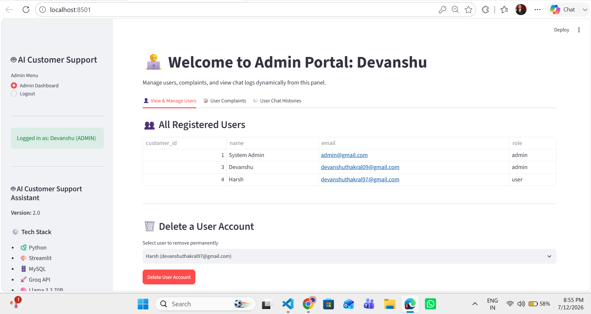

# 🤖 AI Customer Support Chatbot

An AI-powered Customer Support Chatbot built using **Python, Streamlit, MySQL, and Groq API (Llama 3.3 70B)**.

The chatbot allows customers to register, login securely, recover passwords using Email OTP, chat with AI, save conversation history, submit complaints, and provides an Admin Dashboard to manage users and monitor activities.

---

# 🚀 Features

- 🔐 Secure Login & Registration
- 🔑 Forgot Password using Email OTP
- 🔒 Password Hashing (bcrypt)
- 🤖 AI Customer Support Chatbot
- 💬 Chat History
- 📩 Complaint Management
- 👨‍💼 Admin Dashboard
- 👥 User Management
- 📊 View User Chat History
- 🗄️ MySQL Database Integration
- ⚡ Streamlit Web Interface

---

# 🛠️ Tech Stack

- Python
- Streamlit
- MySQL
- Groq API
- Llama 3.3 70B
- bcrypt
- SMTP Email
- dotenv

---

# 📂 Project Structure

```text
AI-Customer-Support-Chatbot/
│
├── app.py
├── auth.py
├── chatbot.py
├── complaint.py
├── history.py
├── admin.py
├── db.py
├── schema.sql
├── requirements.txt
├── .env
├── screenshots/
└── README.md
```

---

# ⚙️ Installation

## Clone Repository

```bash
git clone https://github.com/yourusername/AI-Customer-Support-Chatbot.git
```

```bash
cd AI-Customer-Support-Chatbot
```

Install Packages

```bash
pip install -r requirements.txt
```

Run MySQL Schema

```sql
source schema.sql;
```

Run Project

```bash
streamlit run app.py
```

---

# Environment Variables

Create a `.env` file.

```env
DB_HOST=localhost
DB_USER=root
DB_PASSWORD=your_password
DB_NAME=ai_customer_support

GROQ_API_KEY=your_api_key

EMAIL=your_email@gmail.com
EMAIL_PASSWORD=your_app_password
```

---

# 📷 Project Screenshots

## 🔐 Login Page



---

## 📝 Register Page



---

## 🔑 Forgot Password (OTP)



---

## 💬 Chatbot Home



---

## 🤖 AI Response



---

## 📜 Chat History



---

## 👨‍💼 Admin Dashboard



---

# Admin Features

- View All Users
- Delete Users
- View Complaints
- View Chat History
- Manage User Accounts

---

# User Features

- Register
- Login
- Forgot Password
- OTP Verification
- AI Chat
- Save Chat History
- Raise Complaints

---

# Future Enhancements

- 📱 Mobile Responsive UI
- 📊 Analytics Dashboard
- 🌐 Multi-language Support
- 📄 PDF Chat Export
- 🔔 Email Notifications
- 🎤 Voice Chat Support

---

# Author

**Devanshu Thakral**

B.Tech CSE (AI & ML)

Geeta University

---

## ⭐ If you like this project, don't forget to Star this repository.